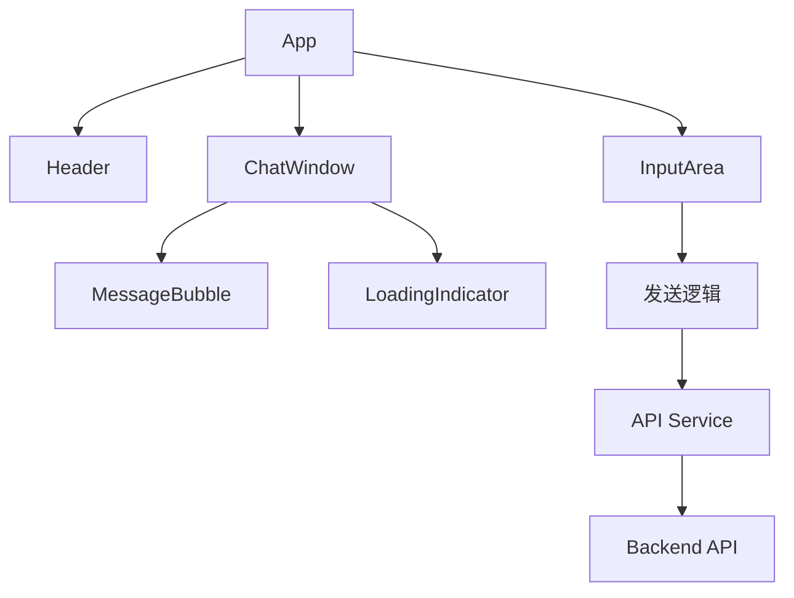

# 技术架构文档

## 四川方言智能对话系统 - 前端架构

---

## 1. 技术选型

### 1.1 核心技术栈

| 技术 | 版本 | 用途 |
|------|------|------|
| React | 18.x | 前端框架 |
| Vite | 5.x | 构建工具 |
| CSS3 | - | 样式与动效 |
| Fetch API | - | HTTP请求 |

### 1.2 开发工具
- Node.js 18+
- npm/pnpm

---

## 2. 项目结构

```
frontend/
├── public/
│   └── favicon.ico
├── src/
│   ├── components/
│   │   ├── Header/          # 头部组件
│   │   ├── ChatWindow/      # 对话窗口
│   │   ├── MessageBubble/   # 消息气泡
│   │   ├── InputArea/       # 输入区域
│   │   └── LoadingIndicator/# 加载指示器
│   ├── services/
│   │   └── api.js           # API调用封装
│   ├── styles/
│   │   ├── variables.css    # CSS变量
│   │   ├── global.css       # 全局样式
│   │   └── animations.css   # 动画样式
│   ├── App.jsx              # 主组件
│   └── main.jsx             # 入口文件
├── index.html
├── package.json
└── vite.config.js
```

---

## 3. 组件设计

### 3.1 组件架构图



### 3.2 组件说明

#### App（主组件）
- 状态管理：messages, isLoading, sessionId
- 生命周期：初始化sessionId

#### Header（头部）
- 显示系统名称
- 简洁的装饰元素

#### ChatWindow（对话窗口）
- 消息列表渲染
- 自动滚动到底部
- 消息动画效果

#### MessageBubble（消息气泡）
- 区分用户/系统消息样式
- 时间戳显示
- 方言文字渲染

#### InputArea（输入区域）
- 文本输入框
- 发送按钮
- 回车键支持
- 空消息验证

#### LoadingIndicator（加载指示器）
- 呼吸动画
- 等待状态展示

---

## 4. 状态管理

### 4.1 状态定义

```javascript
// App组件状态
const [messages, setMessages] = useState([]);  // 消息列表
const [isLoading, setIsLoading] = useState(false);  // 加载状态
const [sessionId] = useState(() => 
  'session_' + Date.now() + '_' + Math.random().toString(36).substr(2, 9)
);  // 会话ID
```

### 4.2 消息数据结构

```javascript
{
  id: 'msg_123',
  type: 'user' | 'system',
  content: '消息内容',
  timestamp: '2026-07-14 22:00:00',
  intent: '美食查询',  // 仅系统消息
  confidence: 0.85     // 仅系统消息
}
```

---

## 5. API设计

### 5.1 接口封装

```javascript
// services/api.js
const API_BASE = 'http://localhost:8000';

export async function sendMessage(message, sessionId) {
  const response = await fetch(`${API_BASE}/api/v1/chat`, {
    method: 'POST',
    headers: { 'Content-Type': 'application/json' },
    body: JSON.stringify({ message, session_id: sessionId })
  });
  return response.json();
}

export async function checkHealth() {
  const response = await fetch(`${API_BASE}/health`);
  return response.json();
}
```

### 5.2 错误处理

- 网络错误：显示友好提示
- 服务器错误：显示错误消息
- 超时处理：30秒超时限制

---

## 6. 样式架构

### 6.1 CSS变量

```css
:root {
  /* 主色调 */
  --color-primary: #D4A84B;
  --color-secondary: #F5F0E6;
  --color-accent: #B8860B;
  
  /* 文字颜色 */
  --color-text: #333333;
  --color-text-secondary: #666666;
  --color-text-light: #FFFFFF;
  
  /* 间距 */
  --spacing-sm: 8px;
  --spacing-md: 16px;
  --spacing-lg: 24px;
  
  /* 圆角 */
  --radius-sm: 8px;
  --radius-md: 12px;
  --radius-lg: 16px;
  
  /* 阴影 */
  --shadow-sm: 0 2px 4px rgba(0,0,0,0.1);
  --shadow-md: 0 4px 8px rgba(0,0,0,0.15);
}
```

### 6.2 响应式断点

```css
/* 移动端 */
@media (max-width: 480px) { }

/* 平板 */
@media (min-width: 481px) and (max-width: 768px) { }

/* 桌面端 */
@media (min-width: 769px) { }
```

---

## 7. 动效设计

### 7.1 关键动画

```css
/* 消息淡入 */
@keyframes fadeIn {
  from { opacity: 0; transform: translateY(10px); }
  to { opacity: 1; transform: translateY(0); }
}

/* 呼吸动画 */
@keyframes pulse {
  0%, 100% { opacity: 1; }
  50% { opacity: 0.5; }
}

/* 按钮悬停 */
.button:hover {
  transform: scale(1.02);
  transition: all 0.2s ease;
}
```

---

## 8. 部署配置

### 8.1 开发环境

```bash
# 安装依赖
npm install

# 启动开发服务器
npm run dev

# 构建生产版本
npm run build
```

### 8.2 代理配置（vite.config.js）

```javascript
export default {
  server: {
    proxy: {
      '/api': {
        target: 'http://localhost:8000',
        changeOrigin: true
      }
    }
  }
}
```

---

## 9. 性能优化

- 组件懒加载
- CSS动画使用transform
- 防抖输入处理
- 消息列表虚拟滚动（大量消息时）

---

## 10. 可访问性

- 语义化HTML标签
- ARIA标签支持
- 键盘导航
- 焦点管理